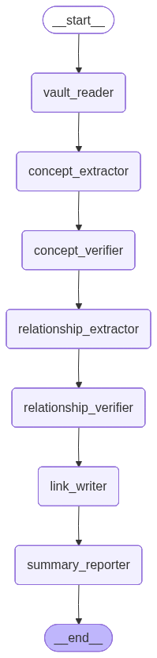

# NeuroNote

A local Streamlit app that organizes your Obsidian vault. Point it at a vault folder and it reads your markdown notes, extracts the core concepts with an LLM, then writes Obsidian tags and `[[wikilinks]]` back into the files — so your graph view actually connects up instead of showing a field of isolated dots.

Everything runs on your machine. The only things that leave it are note contents sent to Groq (for extraction) and Google (for embeddings).

## 📊 Pipeline Graph



## ✨ What it does

- **Concept extraction** — reads each note and pulls out its key ideas, technologies and entities.
- **Smart tagging** — appends 3–5 relevant hashtags (`#machine-learning`, `#devops`) under a `## Tags` heading.
- **Semantic cross-linking** — embeds every concept into a **local FAISS index** stored inside the vault, finds semantically related concepts in *other* notes, and writes `- [[Other Note]]` bullets under `## Related Links`.
- **Strict quality control** — a second LLM pass plus structural filtering rejects weak links, self-links, duplicates and links to notes that don't exist.
- **Cost-efficient caching** — hashes each note (ignoring the auto-generated sections) so re-runs only spend tokens on notes you actually changed.
- **API key rotation** — supply several Groq/Google keys and it rotates through them with exponential backoff when it hits free-tier rate limits.
- **Preview mode** — run the whole pipeline and see exactly what it would write, without touching a single file.

## 🛠️ Tech stack

- **Streamlit** — the local UI.
- **LangGraph / LangChain** — the 7-node pipeline (read → extract → verify → relate → verify → write → report).
- **Groq** — fast inference for extraction, verification and relationship reasoning.
- **Google Generative AI** — concept embeddings (`models/gemini-embedding-2`).
- **FAISS** — local, on-disk vector index. No cloud database, no account needed.

## 🚀 Setup

1. **Clone the repo** and activate your environment:
   ```bash
   conda activate langgraph
   ```
2. **Install dependencies:**
   ```bash
   pip install -r requirements.txt
   ```
3. **Add your API keys** to a `.env` file in the project root. Multiple keys of the same type are rotated automatically:
   ```env
   # Groq (extraction, verification, relationships)
   GROQ_API_KEY_1="gsk_..."
   GROQ_API_KEY_2="gsk_..."

   # Google (embeddings)
   GOOGLE_API_KEY_1="AIza..."

   # Optional model overrides
   LLM_MODEL="llama-3.3-70b-versatile"
   LLM_EXTRACTION="llama-3.1-8b-instant"
   LLM_VERIFICATION="llama-3.1-8b-instant"
   LLM_RELATIONSHIP="llama-3.3-70b-versatile"
   ```
   You can also paste keys straight into the app's sidebar instead of using `.env`.

## 🖥️ Usage

```bash
streamlit run app.py
```

Paste the full path to your vault (e.g. `C:\Users\saraf\Documents\VOID`), then hit **Run linker**. Progress streams live, and when it finishes you get tables of every link, tag and concept it produced.

Two options worth knowing:

- **Preview only** — runs everything but writes nothing. Good for a first look.
- **Re-process every note** — clears the cache and concept index so the whole vault is rebuilt from scratch.

Prefer the terminal?

```bash
python main.py "C:/path/to/vault"      # or: python run_local.py "C:/path/to/vault"
python monitor_keys.py                 # check rate-limit headroom on every key
python tests/test_notes.py             # note read/write round-trip tests
```

## 🧠 How it works

1. **Vault Reader** (`nodes/io.py`) — scans for `.md` files (skipping `.obsidian`, `.trash`, `.git`) and diffs them against `.linker_cache.json` to find new or edited notes.
2. **Concept Extractor** (`nodes/concepts.py`) — sends new notes to Groq concurrently, extracting structured concepts and tags.
3. **Concept Verifier** — cleans and de-duplicates the results, then re-embeds them into `.linker_faiss_index`, dropping stale vectors for edited, renamed or deleted notes.
4. **Relationship Extractor** (`nodes/relations.py`) — queries the FAISS index for the most similar concepts in *other* notes and asks the LLM which are genuinely related.
5. **Relationship Verifier** — a second opinion, plus structural filtering (no self-links, no duplicates, no links to non-existent notes).
6. **Link Writer** (`nodes/io.py`) — rewrites the `## Tags` and `## Related Links` sections of the affected notes via a temp-file swap.
7. **Summary Reporter** — saves the cache so the next run is cheap.

## ✍️ What it writes to your notes

It appends (and thereafter maintains) two sections at the end of a note:

```markdown
## Tags
#containerization #devops

## Related Links
- [[Kubernetes Orchestration]]
```

Only lines the tool itself generated — a run of hashtags, or `- [[link]]` bullets — are ever replaced. As soon as it hits anything else (your prose, a heading, a code fence) it stops and leaves the rest of the file alone, so notes you keep editing by hand are safe. `tests/test_notes.py` covers this.

Two files are created inside your vault, both safe to delete (they'll be rebuilt):

- `.linker_cache.json` — file hashes, concepts, links and tags from the last run.
- `.linker_faiss_index/` — the local vector index.

> **Tip:** back up your vault before the first run. The tool is careful, but it does rewrite files.
